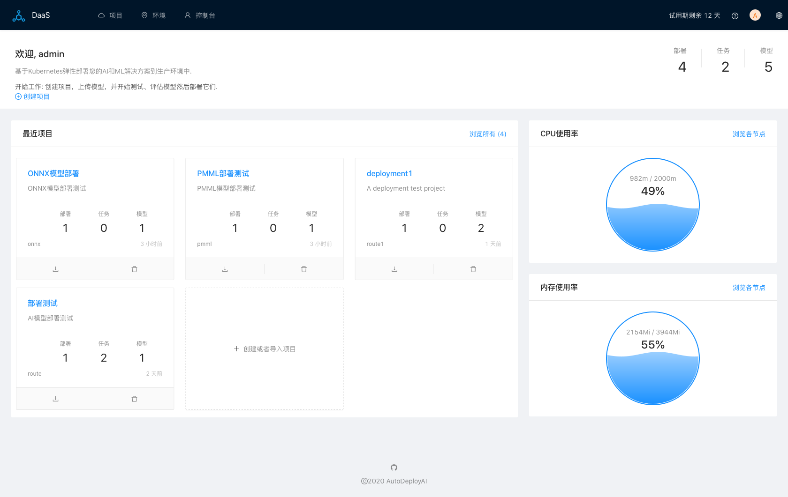
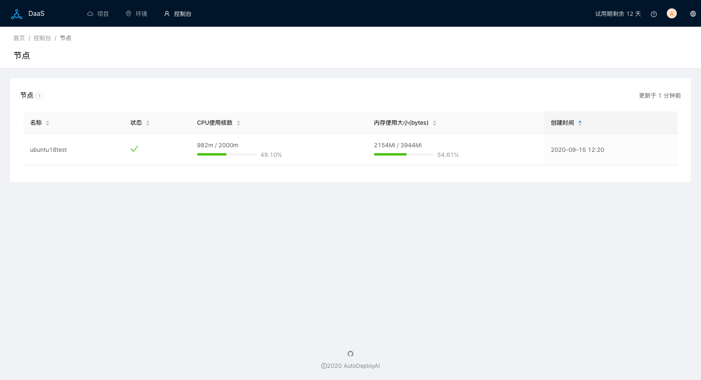
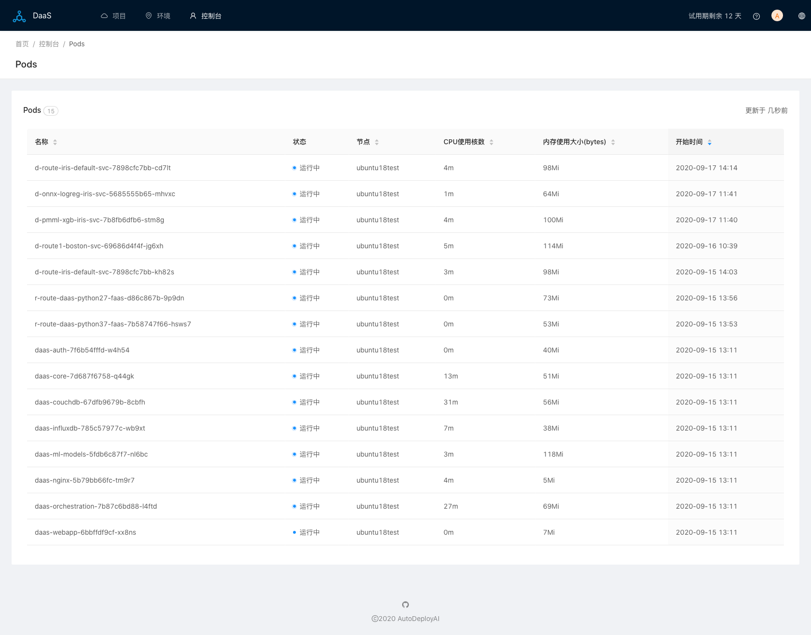
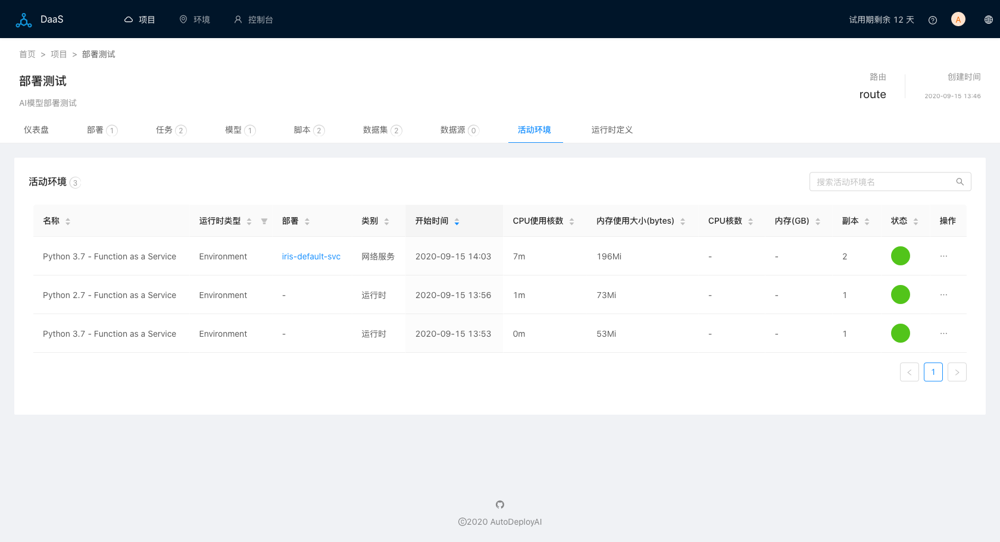
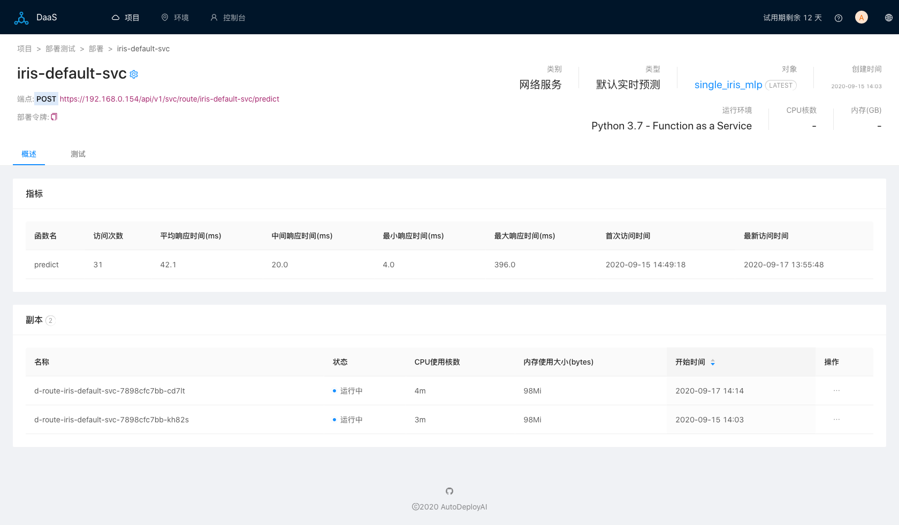
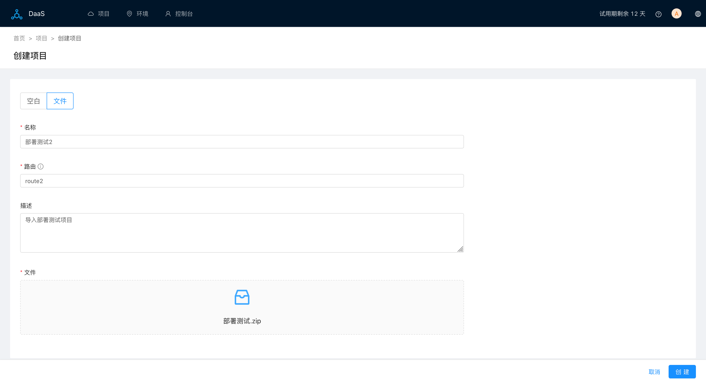
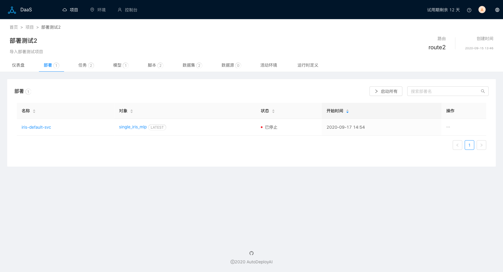
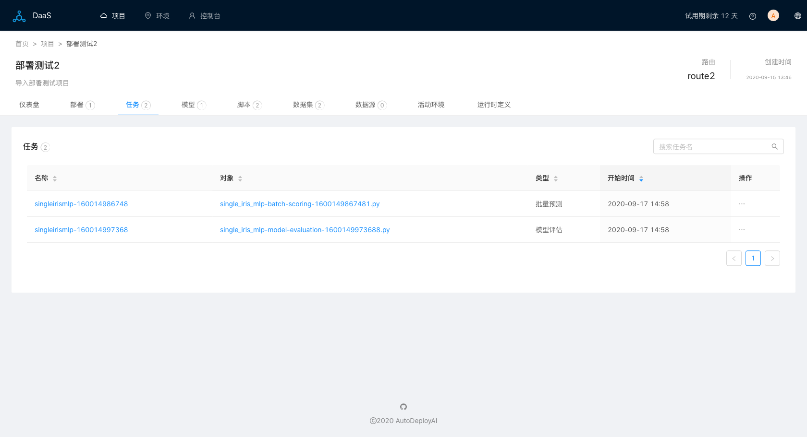

# AI/ML模型自动部署管理系统DaaS 1.2.0新功能

## 系统资源监控

1. 新的首页。显示DaaS底层Kubernetes的资源使用率（CPU和内存）：

主页显示的是k8s各节点累计综合使用率，可以点击`浏览各节点`查看每个节点资源使用，当前k8s环境只有一个节点：

点击菜单 `控制台 / Pods`，可以查看DaaS系统在整个k8s中启动的所有`Pods`的资源使用状况（CPU使用核数和内存使用大小）：

用户可以查看一个项目中活动环境，以及他们的资源使用。一个部署可能有多个副本，这里显示的是多个副本的累计使用量：

也可以查看每一个部署启动的`Pods`的资源使用：

DaaS依赖k8s中的[metrics-server](https://github.com/kubernetes-sigs/metrics-server)来搜集各种资源指标，所以必须在k8s中启动metrics-server来查看资源使用状况。

## 项目导出导入

导出一个项目，生成zip文件，比如最后一个项目`部署测试.zip`，从首页中，点击`创建或者导入项目`，进入创建项目页面，点击`文件`，选择之前导出的文件，并且输入新的项目和路由名称：

导入项目成功后，所有的部署是未启动状态，可以单独启动，或者一次性启动所有部署：

在新版中，我们把任务部署（Job）放到了独立的一个页面来管理，以区别于网络服务部署（Web Service）：

## 试用DaaS

如果您想体验DaaS模型自动部署系统，或者通过我们的云端SaaS服务，或者本地部署，请发送邮件到 autodeploy.ai#http://outlook.com（# 替换为 @），并说明一下您的模型部署需求。
