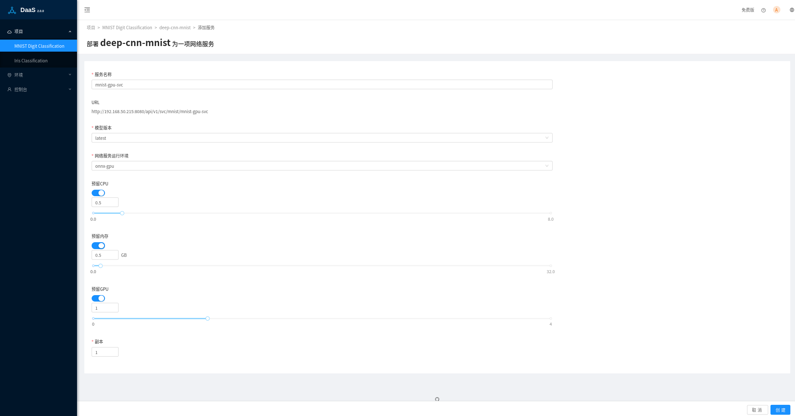
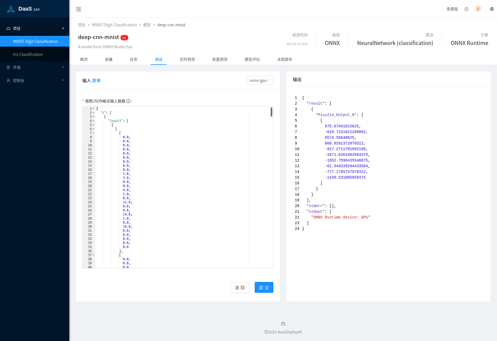
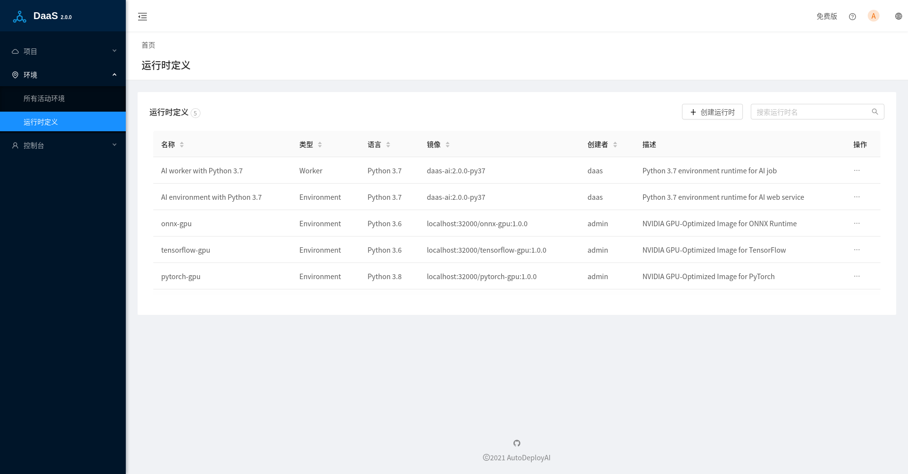
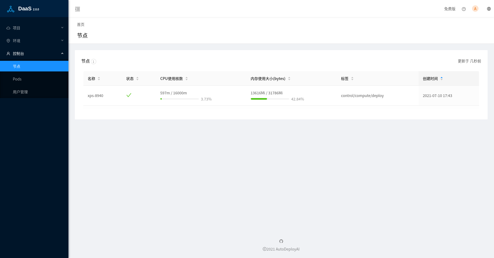

# AI/ML模型自动部署管理系统DaaS 2.0.0

DaaS 2.0.0 主要新功能介绍：

## GPU加速

在创建或者修改部署页面中，除了可以预分配CPU核数和内存大小外，还可以指定部署服务需要的GPU数量：



GPU不能在多个Pods之间共享，一个Pod只能指定一个或者多个GPU，只能是整数个数量，不能使用小数，不同CPU核数。关于在k8s中如何使用GPU，参考官方文档[Schedule GPUs](https://kubernetes.io/docs/tasks/manage-gpus/scheduling-gpus/)。

目前支持NVIDIA GPU，关于如何在k8s环境启用GPU，目前最方便的方法是通过安装[NVIDIA GPU Operator](https://docs.nvidia.com/datacenter/cloud-native/gpu-operator/getting-started.html)，它能自动安装NVIDIA显卡驱动，GPU设备插件，container运行时，自动标记节点等。在[Microk8s](https://microk8s.io/docs/addon-gpu)中，可以通过简单的命令`microk8s.enable gpu`来安装`GPU Operator`。

在模型测试过程中，我们的预测脚本会在日志中输出使用的设备类型，比如CPU或者GPU：



可以看到页面右侧标准输出中的信息`"ONNX Runtime device: GPU"`，ONNX Runtime使用的是GPU，在Shell中输入命令`nvidia-smi`，可以查看那些进程在使用GPU：
```
nvidia-smi 
Sun Jul 11 19:13:26 2021       
+-----------------------------------------------------------------------------+
| NVIDIA-SMI 460.80       Driver Version: 460.80       CUDA Version: 11.2     |
|-------------------------------+----------------------+----------------------+
| GPU  Name        Persistence-M| Bus-Id        Disp.A | Volatile Uncorr. ECC |
| Fan  Temp  Perf  Pwr:Usage/Cap|         Memory-Usage | GPU-Util  Compute M. |
|                               |                      |               MIG M. |
|===============================+======================+======================|
|   0  GeForce GTX 1650    Off  | 00000000:02:00.0  On |                  N/A |
| 40%   43C    P3    25W /  90W |    858MiB /  3902MiB |     34%      Default |
|                               |                      |                  N/A |
+-------------------------------+----------------------+----------------------+
                                                                               
+-----------------------------------------------------------------------------+
| Processes:                                                                  |
|  GPU   GI   CI        PID   Type   Process name                  GPU Memory |
|        ID   ID                                                   Usage      |
|=============================================================================|
|    0   N/A  N/A      1758      G   /usr/lib/xorg/Xorg                 35MiB |
|    0   N/A  N/A      2821      G   /usr/lib/xorg/Xorg                241MiB |
|    0   N/A  N/A      2932      G   /usr/bin/gnome-shell              140MiB |
|    0   N/A  N/A      4203      G   ...AAAAAAAAA= --shared-files       47MiB |
|    0   N/A  N/A      9977      G   /usr/lib/firefox/firefox          155MiB |
|    0   N/A  N/A     11589      G   /usr/lib/firefox/firefox            1MiB |
|    0   N/A  N/A    145526      C   python                            223MiB |
+-----------------------------------------------------------------------------+
```
我们可以看到最后的python进程，就是当前模型预测的进程，模型测试是非占有式操作，上面的调用完成后，再次执行`nvidia-smi`，会发现python进程已经消失。正式的部署进程是完全占有式的，该进程会一直存在。如果k8s中已经没有空闲的GPU，后续创建的部署指定了GPU后，POD会由于没有可用的资源而无法启动。

## 运行时定义（Runtime Definations）

取消了默认自带的基于Python 2.7的运行时，只保留了基于Python 3.7的运行时：`AI environment with Python 3.7`和`AI worker with Python 3.7`，它们基于同一个镜像`daas-ai:2.0.0-py37`，该镜像打包了几乎所有流行的基于Python的机器学习和深度学习的库，方便用户的测试，考虑镜像的体积，深度学习库都是基于CPU版本。对于深度学习的GPU版本，可以创建它们独立的运行时。我们在Github（https://github.com/autodeployai/daas-runtimes）中开源了上面镜像的Dockerfile，以及深度学习库ONNX Runtime，Tensorflow和Pytorch基于GPU加速的部署镜像。



在正式的部署过程中，建议用户创建基于自己使用的模型训练库的版本的运行时来部署模型，特别是使用pickle/joblib这种基于语言的二进制序列化格式，使用不同的库版本可能会导致加载模型失败或者其他兼容性问题。


## 基于节点标签（Node Labels）来分配Pods

为了更好的管理和分配k8s中各个节点的资源，通过使用Node Labels把节点分为三类：
1. 控制节点（control），运行DaaS本身的各个Pods，包括Nginx代理服务器，webapp，以及其他微服务。
2. 计算节点（compute），包括模型验证，模型测试，以及任务部署（job)。
3. 部署节点（deploy），主要是运行服务部署（service）。

一个物理节点可以设置为一个或者多个不同的标签，比如在单节点Micork8s环境中，我们需要设置当前node同时包含以上三种Labels。



## 支持绑定HTTP端口

之前默认绑定HTTPS端口，DaaS包含了一个自验证（Self-Certification）的SSL证书，在有些浏览器中会阻止访问该地址，通过我们新的脚本[bind-external-ip.sh](https://github.com/autodeployai/daas-microk8s)，除了HTTPS端口，可以同时绑定一个HTTP的端口，在内部网络中使用也会更加高效。

```
bind-external-ip.sh xxx.xxx.xxx.xxx [HTTPS_PORT] [HTTP_PORT]
```

## 获取免费的单节点版本DaaS-microk8s

DaaS-microks是安装在k8s单节点发行版microk8s的DaaS免费版本，提供DaaS完全的模型部署功能，可以离线安装。如果您想在本地部署，请发送邮件到 autodeploy.ai#outlook.com（# 替换为 @），并说明一下您的所在公司名称以及模型部署需求。
